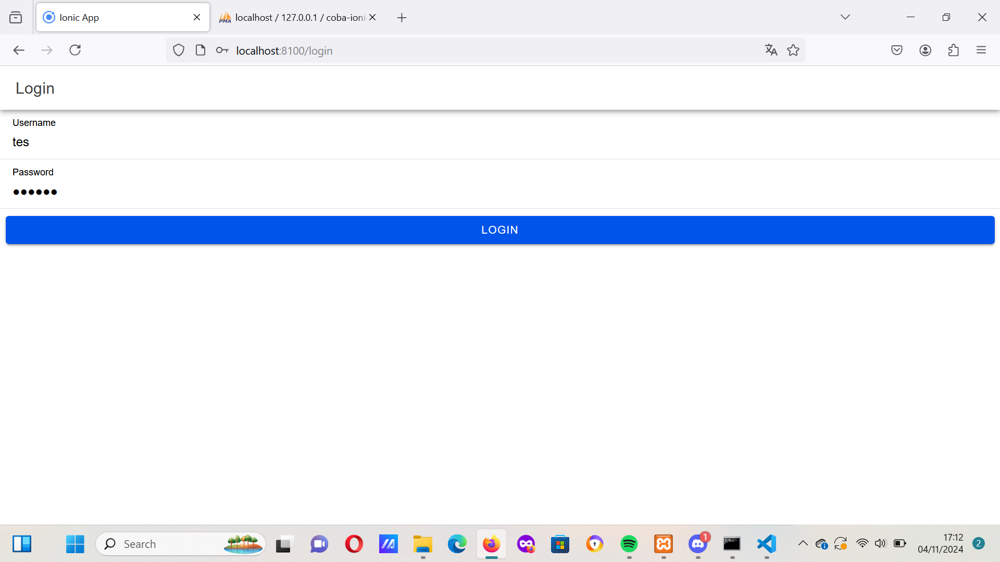
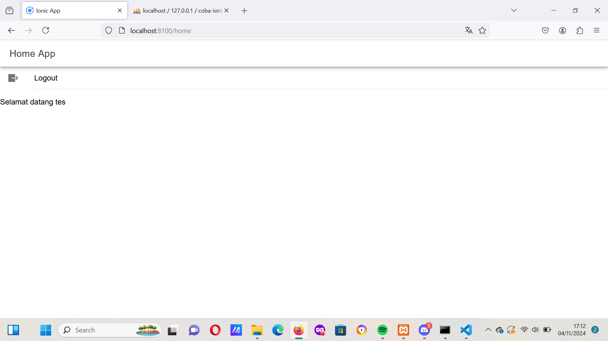

## Penjelasan
langkah langkah cara kerja loginnya sebagai berikut:
1. Membuat Database dan API PHP
- Database: Dibuat di MySQL dengan tabel user yang berisi kolom username dan password. Data pengguna ditambahkan dengan hashing password menggunakan MD5.
- API PHP: Dua file utama dibuat, yaitu koneksi.php untuk koneksi ke database dan login.php untuk autentikasi. Dalam login.php, aplikasi membaca data JSON yang dikirim dari Ionic, lalu memverifikasi username dan password pengguna dengan mencari kecocokan di database.

2. Persiapan Project Ionic
- Aplikasi dibuat menggunakan Ionic CLI, dengan beberapa komponen utama: halaman login, layanan otentikasi (authentication.service.ts), dan guard (authGuard dan autoLoginGuard) untuk melindungi rute.
- Service Otentikasi: Menyimpan data pengguna (token dan username) menggunakan Capacitor Preferences, melakukan permintaan POST ke API, dan mengatur status autentikasi.

3. Otentikasi dengan Guard
- Guard digunakan untuk mengatur akses halaman:
  - authGuard: Memastikan hanya pengguna yang terautentikasi yang dapat mengakses halaman home. Jika tidak, pengguna akan diarahkan ke halaman login.
  - autoLoginGuard: Mencegah pengguna yang sudah login mengakses halaman login lagi dengan mengarahkan mereka ke halaman home.

4. Halaman Login
- Halaman login.page.html memiliki input untuk username dan password, serta tombol untuk melakukan login.
- Di login.page.ts, saat tombol login diklik, aplikasi akan memeriksa apakah username dan password sudah diisi. Jika lengkap, aplikasi akan mengirim data ke API PHP menggunakan metode postMethod pada AuthenticationService.
- Validasi Hasil Login:
  - Jika login berhasil, server akan mengirimkan respons berisi token dan status login. AuthenticationService akan menyimpan token dan username di perangkat menggunakan Capacitor Preferences, serta mengubah status autentikasi menjadi true.
  - Jika gagal, aplikasi akan menampilkan notifikasi yang memberitahu bahwa kredensial salah atau ada masalah koneksi.

5. Halaman Home dan Logout
- Di home.page.html, terdapat tombol Logout. Pada home.page.ts, tombol ini memanggil fungsi logout() di AuthenticationService, yang membersihkan data login dari perangkat dan mengarahkan pengguna kembali ke halaman login.
  
## Screenshot

